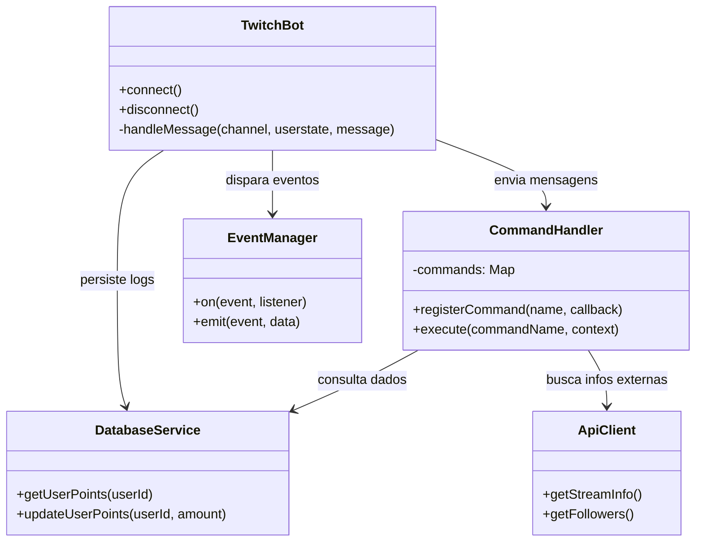

# TwitchBot Pro

[](https://nodejs.org/)
[](https://www.typescriptlang.org/)
[](https://tmijs.com/)
[](https://opensource.org/licenses/MIT)

## Visão Geral

O **TwitchBot Pro** é uma solução robusta e modular para automação de transmissões na Twitch. Projetado para oferecer alta escalabilidade e facilidade de personalização, o bot integra funcionalidades de moderação automática, sistema de lealdade (points system), comandos dinâmicos e integração com APIs externas. Ele permite que streamers foquem no conteúdo enquanto a interação com o chat é gerenciada de forma inteligente.

## Arquitetura e Design de Software

O projeto segue princípios de **Clean Architecture** e o padrão **Event-Driven**, garantindo que cada componente seja independente e testável. A separação de responsabilidades permite adicionar novos comandos ou serviços sem impactar o núcleo do bot.

### Estrutura de Pacotes

| Pacote | Responsabilidade |
| :--- | :--- |
| `src/core` | Núcleo do bot, gerenciamento de conexão IRC e orquestração de eventos. |
| `src/commands` | Implementação de comandos (ex: `!play`, `!rank`, `!socials`). |
| `src/services` | Integrações externas (Twitch API, bancos de dados, APIs de música). |
| `src/models` | Definições de tipos e interfaces (TypeScript) para usuários e configurações. |
| `src/utils` | Funções auxiliares, loggers e formatadores de mensagens. |
| `src/database` | Camada de persistência (Suporte a SQLite/MongoDB). |

### Diagrama de Arquitetura (Mermaid)



## Funcionalidades Principais

*   **Moderação Inteligente:** Filtros configuráveis para spam, caps lock excessivo, links proibidos e palavras-chave banidas.
*   **Sistema de Lealdade:** Atribuição automática de pontos por tempo de visualização e comandos de consulta de ranking.
*   **Comandos Dinâmicos:** Criação de comandos personalizados via chat ou arquivo de configuração com suporte a variáveis.
*   **Integrações Externas:** Suporte nativo para consultar estatísticas de jogos, previsões do tempo e integração com StreamElements/Streamlabs.
*   **Sistema de Sorteios (Giveaways):** Gerenciamento completo de sorteios com filtros para seguidores ou inscritos.
*   **Notificações de Eventos:** Alertas automáticos para novos seguidores, subs e raids diretamente no chat.

## Tecnologias e Dependências

*   **Node.js & TypeScript:** Ambiente de execução e linguagem com tipagem estática.
*   **tmi.js:** Biblioteca principal para comunicação com o protocolo IRC da Twitch.
*   **Axios:** Para requisições a APIs REST externas.
*   **Dotenv:** Gerenciamento seguro de variáveis de ambiente.
*   **Winston:** Sistema de logs avançado para monitoramento de erros e atividades.

## Instalação e Configuração

### Pré-requisitos
*   Node.js v18 ou superior.
*   Uma conta na Twitch para o bot.
*   Token OAuth da Twitch (obtido em [twitchapps.com/tmi](https://twitchapps.com/tmi/)).

### Passo a Passo

1.  **Clone o repositório:**
    ```bash
    git clone https://github.com/GilvanPedro/TwitchBot.git
    cd TwitchBot
    ```

2.  **Instale as dependências:**
    ```bash
    npm install
    ```

3.  **Configure as variáveis de ambiente:**
    Crie um arquivo `.env` na raiz do projeto:
    ```env
    TWITCH_USERNAME=SeuBotNome
    TWITCH_OAUTH_TOKEN=oauth:seu_token_aqui
    TWITCH_CHANNELS=canal1,canal2
    DB_PATH=./database.sqlite
    ```

4.  **Compile e execute:**
    ```bash
    npm run build
    npm start
    ```

## Exemplo de Interação (Chat)

```text
Usuário: !pontos
Bot: @Usuário, você possui 1.250 pontos de lealdade! 🏆

Usuário: !social
Bot: Acompanhe o GilvanPedro nas redes: Twitter: @GilvanPedro | GitHub: /GilvanPedro

Moderador: !banword add "palavra_ruim"
Bot: [MOD] A palavra "palavra_ruim" foi adicionada à lista de filtros.
```

## Contribuição

Contribuições são bem-vindas! Siga os passos abaixo:
1. Faça um **Fork** do projeto.
2. Crie uma **Branch** para sua feature (`git checkout -b feature/NovaFuncionalidade`).
3. Faça o **Commit** das alterações (`git commit -m 'Adicionando nova funcionalidade'`).
4. Envie para o **Repo Original** (`git push origin feature/NovaFuncionalidade`).
5. Abra um **Pull Request**.

## Licença

Distribuído sob a licença MIT. Veja `LICENSE` para mais informações.

---
Desenvolvido com 💜 por [Gilvan Pedro](https://github.com/GilvanPedro)
